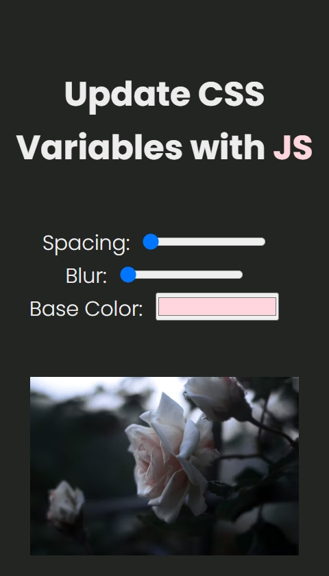

# Updating CSS Variables Using JavaScript

A web app that allows users to dynamically update CSS variables using JavaScript to change the appearance of a page in real-time. This project demonstrates the flexibility of CSS variables and JavaScript interaction for modifying visual elements like spacing, blur, and color.

## Description

This project features a settings panel where users can interact with range sliders and color pickers to adjust various CSS properties of the page, including spacing, blur, and color. The changes are immediately reflected on an image, demonstrating the power of CSS variables and JavaScript together to create a dynamic user experience. The project is fully responsive and adapts to various screen sizes, making it accessible on both mobile and desktop devices.

## Features

- Adjustable settings for spacing, blur, and base color using range sliders and a color picker.
- Real-time updates of visual elements based on user input.
- Fully responsive layout that adjusts for different screen sizes.
- Clean and modern design with a focus on usability and simplicity.
- Easy-to-understand JavaScript for modifying CSS variables dynamically.
- Customizable appearance with the use of CSS variables, allowing for easy theme changes.

## Technologies Used

- HTML
- CSS
- JavaScript

## How to Run

1. Clone the repository to your local machine.
2. Open `index.html` in your web browser.
3. Alternatively, you can view the live project on GitHub Pages: [Updating CSS Variables on GitHub Pages](https://deannamandarino.github.io/updating-css-variables/).

## Acknowledgments

This project was completed as part of the JavaScript30 course. Special thanks to Wes Bos for the excellent resources and guidance throughout the course.